# Архитектура маркетплейса

Покупатели получают персональную ленту и оформляют заказы, продавцы управляют товарами. Система также управляет пользователями, рассчитывает и учитывает платежи, отправляет уведомления о статусах заказов. Бизнес-функции на этом этапе только проектируются.

## C4 Container

Сплошные стрелки — синхронные вызовы, пунктирные — асинхронные события через брокер. Сам брокер и вспомогательные связи опущены для читаемости; полный список взаимодействий приведён ниже. Каждый доменный блок объединяет сервис с его собственной БД.

## Домены, сервисы и данные

| Домен / сервис | Ответственность | Данные, которыми владеет |
| --- | --- | --- |
| Пользователи / Identity | Покупатели и продавцы, профили, роли, доступ | Учётные записи, контакты, настройки и согласия |
| Каталог / Catalog | Товары продавцов, цены, доступность и резервирование | Карточки, предложения, остатки и резервы |
| Персонализация / Feed | Подбор и ранжирование ленты | Интересы, история просмотров, популярность и проекция каталога |
| Заказы / Orders | Оформление, состав и статусы заказа | Заказы, снимки позиций, цен и контактов на момент покупки |
| Платежи / Payments | Расчёт комиссии, оплата, возвраты и учёт денежных операций | Платёжные попытки, суммы, комиссия и финансовый журнал |
| Уведомления / Notifications | Доставка сообщений о статусах заказов | Шаблоны, задания, результаты отправки и проекция контактов |

Каждый домен выделен в отдельный сервис: каталог меняется продавцами, лента обслуживает чтение, заказы координируют покупку, платежи отвечают за финансовую точность, уведомления зависят от доставки сообщений. Identity даёт всем доменам единую идентичность пользователя. Эти обязанности имеют разные причины изменений и отказов.

У каждого сервиса отдельная БД, доступная только владельцу. Общих таблиц и прямого чтения чужих БД нет. Копия каталога в Feed и контактов в Notifications — производные данные; их источники остаются Catalog и Identity. Снимок заказа сохраняет историю покупки независимо от последующих изменений товара или профиля.

## Взаимодействия

| Кто → кому | Способ | Назначение |
| --- | --- | --- |
| Веб-приложение → Gateway → Identity, Catalog, Feed, Orders, Payments | Синхронно | Профиль, каталог, лента, заказы и статус оплаты |
| Orders → Catalog | Синхронно | Проверка актуальных цен, резерв и его освобождение |
| Orders → Identity | Синхронно | Контакты покупателя для снимка заказа |
| Orders → Payments → платёжный провайдер | Синхронно | Создание оплаты или возврата |
| Платёжный провайдер → Payments | Асинхронно | Подтверждение результата оплаты |
| Notifications → провайдер email/SMS | Синхронно, в фоне | Отправка сообщения |
| Catalog → Feed | Асинхронно, через брокер | Изменения предложений для ленты |
| Identity → Feed, Notifications | Асинхронно, через брокер | Настройки интересов; отдельно контакты и настройки доставки |
| Feed → Feed | Асинхронно, через брокер | Обработка просмотров для персонализации |
| Orders → Feed, Notifications | Асинхронно, через брокер | Завершённые покупки для ленты; статусы для уведомлений |
| Payments → Orders | Асинхронно, через брокер | Успех или отказ оплаты, результат возврата |
| Feed → Catalog | Синхронно | Восстановление проекции каталога |

Обычное чтение ленты использует данные Feed. При покупке Orders проверяет актуальную цену и доступность в Catalog: устаревшая лента не становится основанием для списания денег.

## Архитектурные решения

- **Простая персонализация:** категории недавних просмотров и покупок получают приоритет; затем учитываются популярность и новизна. Без истории или при отключённой персонализации показываются популярные новые товары. Решение объяснимо и не требует отдельной сложной подсистемы рекомендаций.
- **Заказ и платёж разделены:** Orders фиксирует сумму покупки, Payments рассчитывает комиссию и ведёт финансовый учёт. Изменение каталога не меняет уже оформленный заказ.
- **События для распространения изменений:** сбой отправки уведомления не блокирует оплату. Цена этого решения — задержки обновления проекций и необходимость безопасно обрабатывать повторные события.
- **Отдельные БД:** сервисы независимо меняют свои данные. Цена — отсутствие общей транзакции: Orders координирует процесс, освобождает резерв при отказе оплаты и инициирует возврат, если оплаченный заказ невозможно подтвердить.

## Альтернативы и финальный выбор

| Вариант | Разбиение | Плюсы | Минусы |
| --- | --- | --- | --- |
| Модульный монолит | Шесть доменных модулей в одном приложении | Проще сопровождать; заказ и резерв можно фиксировать одной транзакцией | Лента масштабируется вместе с оплатой; отказ процесса затрагивает все функции |
| Три крупных сервиса | Commerce: каталог + заказы; Engagement: пользователи + лента + уведомления; Payments отдельно | Меньше сетевых границ; финансовые данные изолированы | Нагрузка ленты увеличивает ресурсы управления пользователями; каталог и заказы имеют общий цикл релизов и отказов |
| **Шесть доменных сервисов — выбран** | По сервису и БД на каждый домен | Лента и уведомления масштабируются независимо; ясные владельцы данных; финансовые операции изолированы | Больше инфраструктуры; распределённый заказ требует компенсаций; данные согласуются с задержкой |

Выбран последний вариант: требования кейса разделяют управление каталогом, персональную выдачу, оформление заказа и финансовый учёт. Отдельные границы позволяют менять и масштабировать эти обязанности независимо, а сбои уведомлений не влияют на покупку. Это осознанный обмен простоты эксплуатации на независимость доменов; для небольшой команды без таких потребностей монолит был бы дешевле.
